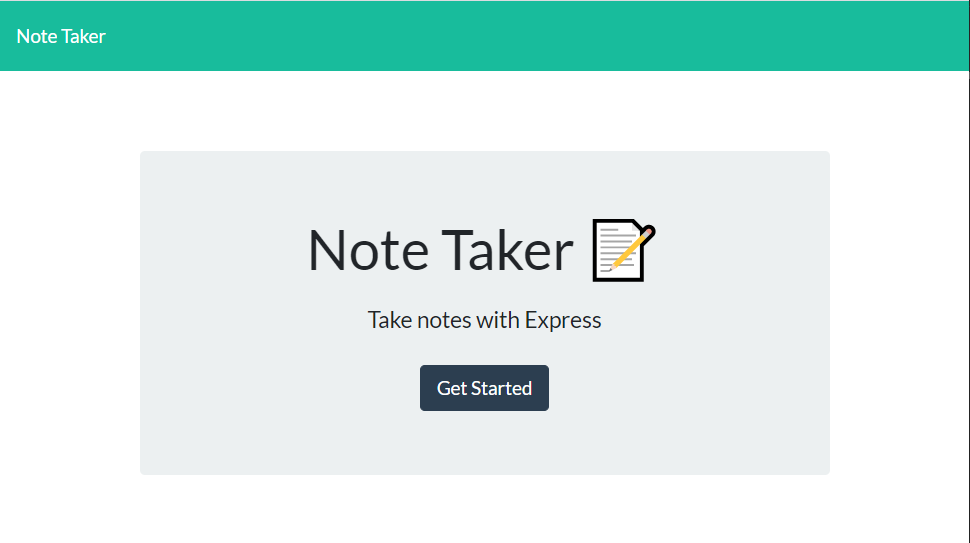
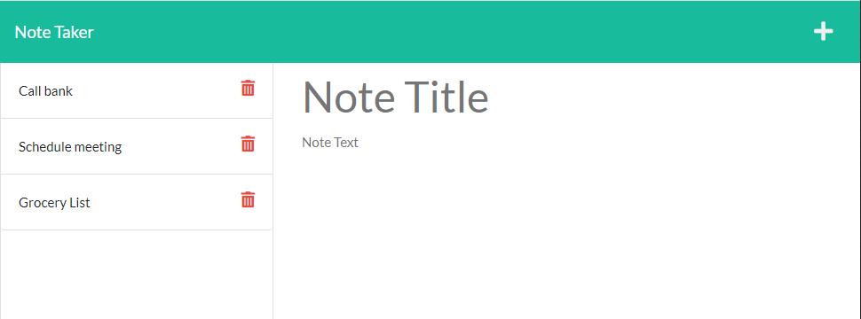
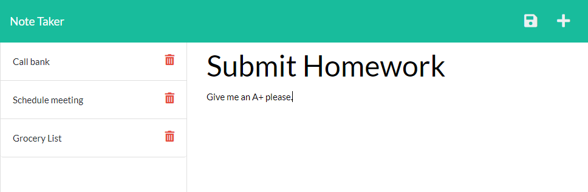
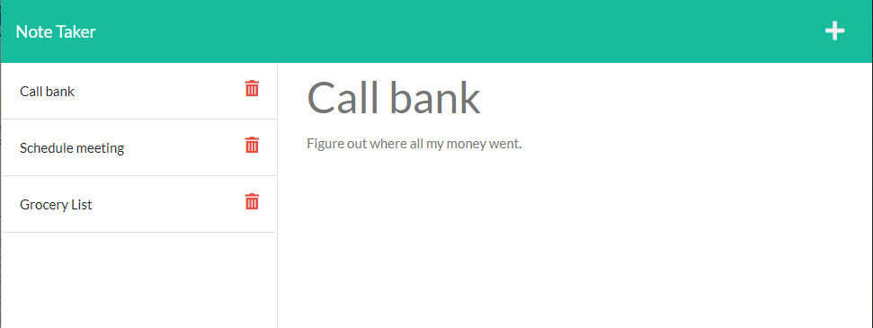

# Note Taker Express

## Description

Note Taker Express is a full-stack note-taking application, built with Express.js, that will store your thoughts and to-do's, so that your brain doesn't have to. Users are able to save, view, and delete notes at any time by accessing and writing data to a JSON file.

[Deployed Application](https://note-taker-express-spreston4.herokuapp.com/)

[GitHub Repo](https://github.com/spreston4/note-taker-express)

## Technologies Used

Built in Visual Studio with:
* Node.js
* JavaScript / jQuery
* Express
* UUIDv4
* Utils

## How To

When the application loads, the user is presented with the following landing screen. Press the 'Get Started' button to start saving notes.



The user is then presented with a list of their previous notes on the left of the screen, and an option to create a new note on the right sode of the screen. Users can delete previous notes but clicking the red trash can icon next to the note they wish to delete.



To save a new note, enter a title and body for the new note. Once the required information is entered, a save icon appears in the top right of the screen. Pressing the save icon will save the new note to the json database, and populate the note title to the note list.



To view a previously stored note, click the name of the note you wish to view from the notes list. The selected note is then displayed to the right side of the screen. From this view, click the plus icon to create a new note.




## User Story

```
AS A small business owner
I WANT to be able to write and save notes
SO THAT I can organize my thoughts and keep track of tasks I need to complete
```

## Acceptance Criteria

```
GIVEN a note-taking application
WHEN I open the Note Taker
THEN I am presented with a landing page with a link to a notes page
WHEN I click on the link to the notes page
THEN I am presented with a page with existing notes listed in the left-hand column, plus empty fields to enter a new note title and the note’s text in the right-hand column
WHEN I enter a new note title and the note’s text
THEN a Save icon appears in the navigation at the top of the page
WHEN I click on the Save icon
THEN the new note I have entered is saved and appears in the left-hand column with the other existing notes
WHEN I click on an existing note in the list in the left-hand column
THEN that note appears in the right-hand column
WHEN I click on the Write icon in the navigation at the top of the page
THEN I am presented with empty fields to enter a new note title and the note’s text in the right-hand column
```

## Contact Me

Contact me via e-mail, or check out my GitHub!

* GitHub: [spreston4](https://github.com/spreston4)
* E-mail: [sam.preston11@gmail.com](mailto:sam.preston11@gmail.com)
